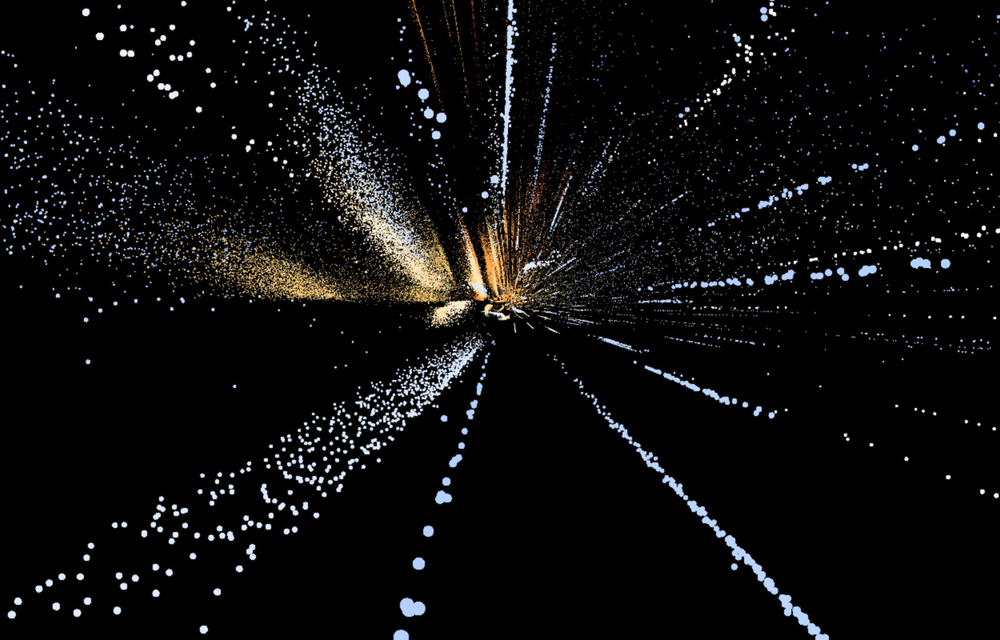

# **Latent Stars**   
A Full-Stack Approach to Visualizing 3D Stellar Data

## **About the Project**

This project uses machine learning to explore and visualize the vast and complex HYG stellar database. The core goal is to compress high-dimensional stellar data into a low-dimensional latent space and then visualize both the physical galaxy and the learned latent space using a 3D web environment built with Three.js.

By training a dynamically structured autoencoder on stellar properties like absolute magnitude, color index, and spectral type, we've created a 3D "latent map" that organizes stars based on their core physical characteristics. This project demonstrates the power of deep learning for scientific data analysis and uncovers hidden structures in astronomical datasets.

## **Key Project Features & Skills**

This project showcases the following skills:

**Machine Learning**: Dynamic Autoencoder Architecture, Latent Space Theory

**Hyperparameter Optimization**: Using Optuna for automated tuning and analysis of hyperparameter importance.

**Data Science**: Data preprocessing, feature engineering, and statistical analysis on astronomical data.

**Full-Stack Development**: Building a web application from the ground up, including a Python backend for data processing and a JavaScript frontend for interactive visualization.

**3D Visualization**: Implementing complex, interactive 3D visualizations using Three.js.

## **Data**

The project utilizes the HYG Database, a comprehensive catalog of over 100,000 stars. The raw data includes a star's Galactic coordinates (x, y, z), absolute magnitude (absmag), and spectral type (spect).  

<https://codeberg.org/astronexus/hyg>

## **Methodology**

**Dimensionality Reduction**: A custom autoencoder was trained to compress the stellar data. The model was designed with a dynamic architecture that adapts to a given set of hyperparameters. This allowed for an extensive search of the optimal model size and shape.

**Hyperparameter Tuning**: Optuna was used to automate the search for the best model architecture. This process involved debugging and refining a custom loss function to correctly balance the reconstruction of both continuous (numerical) and categorical features, a critical step in achieving a functioning model. We analyzed the relationships between hyperparameters and performance to gain a deeper understanding of the model's behavior.

## **Visualization**

**Galactic View**: The project visualizes stars in their true Galactic coordinates, providing a familiar view of our solar neighborhood.

**Latent Space View**: A key feature of the project is the ability to switch to a visualization of the latent space. In this view, stars are positioned by the 3D vectors learned by the autoencoder.

**Physical Properties**: To enhance the visualization's scientific accuracy, the radius of each star is estimated using the Stefan-Boltzmann Law (R=L/(4πσT4)
​), which relates luminosity (L) and temperature (T).

Luminosity is derived from the star's absolute magnitude.

Temperature is approximated from the star's spectral type and subtype.

## **Key Findings**

**Structured Latent Space**: After correcting the loss function, the model successfully created a continuous, 3D curving ribbon of stars in the latent space. This new structure accurately maps the progression of spectral types, confirming that the model has learned the underlying relationships in the data. This visualization is at the heart of our project, showing the unexpected structure that can emerge from data science.

## **Next Steps**

This is a preliminary report on the project's initial findings. Future work will involve a deeper analysis of the clusters identified in the latent space, and the addition of interactive elements to allow users to query and learn about individual stars. Review, feedback, and constructive criticism are welcome as we continue to refine this project.  

## **Technical Stack**

Three.js: A JavaScript 3D library for creating the interactive visualizations.

Pytorch: Used for building and training the autoencoder.

Python: Used for data processing and statistical analysis.

## **Contributing**

Contributions are welcome\! If you have suggestions for improvements, new features, or bug fixes, please open an issue or submit a pull request.

## **License**

This project is licensed under the [MIT License](LICENSE).

## **Contact**

Michael Raymond Morales  
E-mail: michaelraymondmorales@gmail.com  
Project Link: https://github.com/michaelraymondmorales/Latent-Stars  
LinkedIn Profile: https://linkedin.com/in/raymond-morales-1727023